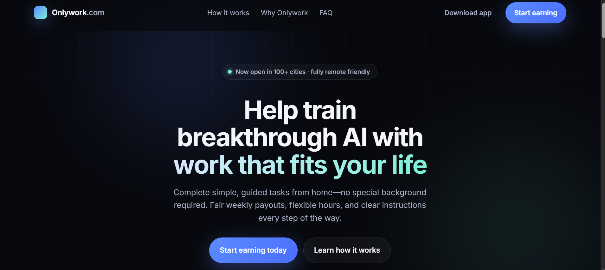
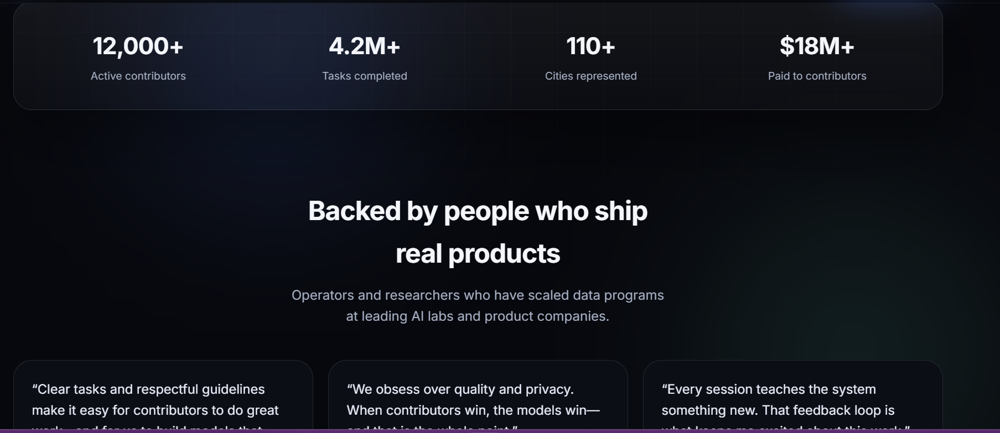

# 🚀 Onlywork.com

A clean, responsive landing page for **Onlywork** — a contributor-style, remote-friendly productivity platform designed to help users focus on meaningful work.

This project demonstrates modern frontend structure, responsive design, and clean UI principles inspired by high-quality SaaS marketing pages.

> ⚠️ This project contains original content and is not affiliated with Atlas Capture.

---

## 🌐 Live Demo

https://github.com/its-muchiri/Only-work-.com

---

## 🧠 Project Overview

Onlywork is built as a **minimal, distraction-free landing page** with a strong focus on:

- Clarity of message  
- Clean user experience  
- Responsive design across devices  
- Lightweight performance  

It is ideal as a foundation for:
- SaaS landing pages  
- Startup websites  
- Product marketing pages  

---

## ✨ Features

- 📱 Fully Responsive Design  
- ⚡ Fast Loading & Lightweight  
- 🎯 Clean UI/UX Structure  
- 🧩 Modular File Organization  
- 🔧 Easy to Customize  

---

## 🛠 Tech Stack

- HTML5  
- CSS3 (Flexbox & Responsive Design)  
- JavaScript (Vanilla)  
- Git & GitHub  

---

## 📸 Screenshots


> Example:
> - Homepage view  
> - Mobile responsiveness  
> - Key sections  

---

## 📂 Project Structure

```text
.github/
  workflows/
    pages.yml
index.html
styles.css
script.js
README.md